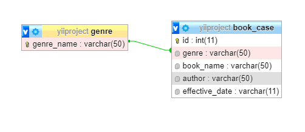
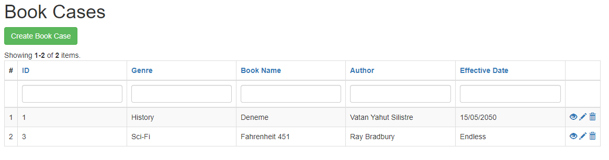
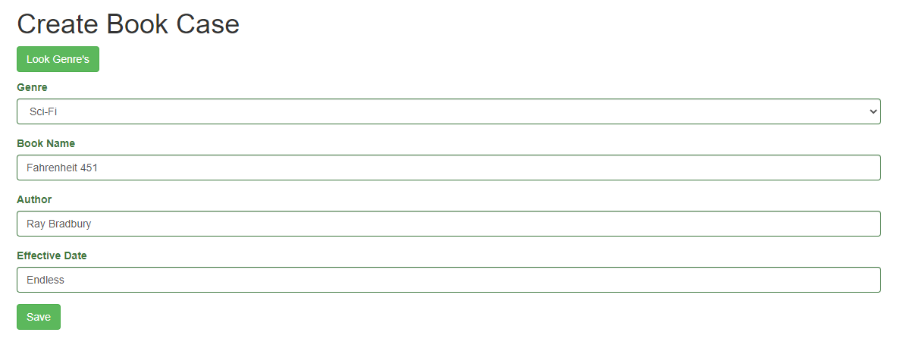
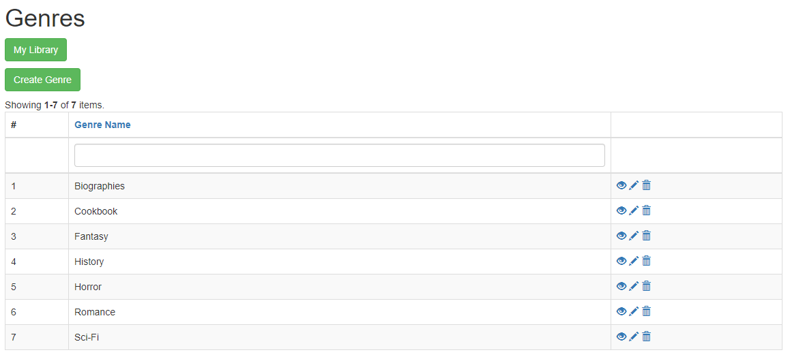

## Yii2 Library Module

Kütüphane Modülü

## Hakkında

Bu modülü kullanarak kütüphanedeki insanların aldığı kitapları takip edebilirisniz. Ayrıca kitaplar için tür de eklenebilir.

## Kurulum

Modül kurulumu vagrant ve yii2-advanced template'i üzerinden anlatılacaktır. Modül kurulumu için öncelikle vagrant üzerinde çalışan yii2-advanced kurulumunu gerçekleştiriniz.

ssh veya vagrant ssh ile vagrant üzerinde yii projenizin ana dizinine gidiniz.(Örneğin /var/www/advanced)

```
 composer require --prefer-dist eneskayiklik/yii2-library "dev-main"
```

komutu ile packagist üzerinden modül kurulumunu gerçekleştiriniz.

Daha sonrasında yii projenizin ana dizininde backend\config\main.php dosyasını düzenlemek için açınız. Aşağıda gösterildiği şekilde düzenlemeyi yapınız.

```
    'modules' => [
        'library' => [
            'class' => 'eneskayiklik\library\Library',
        ],
    ],

```

Modülün çalışabilmesi için son olarak migration işleminin gerçekleştirilmesi gereklidir.

ssh bağlantısı ile vagrant üzerinde proje ana dizinindeyken alttaki komut çalıştırılmalıdır.

```
    php yii migrate/up --migrationPath=@vendor/eneskayiklik/yii2-library/src/migrations
```

Artık migration işlemimiz gerçekleştirilmiştir. Modülümüz çalışır hale gelmiştir.

Modülü test etmek için tarayıcınızda

```
    siteAdresi/backend/web/index.php?r=library/book-case
```

adresine gidiniz. Modül anasayfasını karşınızda göreceksiniz.

## Migrations

Modül içerisindeki migration dosyasında modül içerisinde kullanılacak 2 adet tablo oluşturulmuştur. Tablolar arasında foreign key ile ilişki kurulmuştur ve anahtar değerler için indekslemeler yapılmıştır. genre ve book-case isimli 2 adet tablo bulunmaktadır. Tablolar arasındaki ilişki aşağıda gösterildiği şekildedir. 1 adet foreign key kullanılmıştır.

## Uygulaam içerisinden görüntüler








